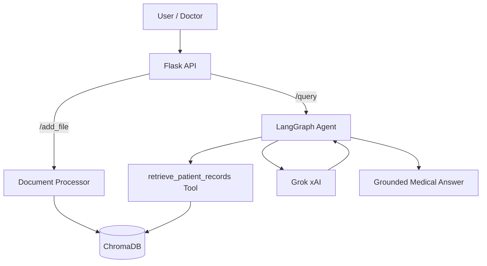

# 🏥 Automated Medical RAG API System (AI-Agent)

An enterprise-grade **medical Retrieval-Augmented Generation (RAG)** backend system built with **Flask**, **LangGraph**, **ChromaDB**, **HuggingFace Embeddings**, and **Grok (xAI)**. It provides secure, patient-specific medical Q&A by retrieving relevant context from uploaded medical records before generating answers.

[](https://www.python.org/)
[](https://flask.palletsprojects.com/)
[](https://langchain-ai.github.io/langgraph/)
[](https://www.trychroma.com/)
[](https://huggingface.co/)
[](https://x.ai/)
[](https://www.docker.com/)
[](LICENSE)

---

## 📋 Table of Contents

- [About](#-about)
- [Key Features](#-key-features)
- [Architecture](#-architecture)
- [Tech Stack](#-tech-stack)
- [Project Structure](#-project-structure)
- [Prerequisites](#-prerequisites)
- [Installation](#-installation)
  - [Local Setup](#local-setup)
  - [Docker Deployment](#docker-deployment)
- [Configuration](#-configuration)
- [Usage](#-usage)
- [API Endpoints](#-api-endpoints)
- [Example Questions](#-example-questions)
- [Notes & Best Practices](#-notes--best-practices)
- [Contributing](#-contributing)
- [License](#-license)

---

## 📖 About

**Automated Medical RAG API System** is a backend API that enables healthcare professionals to query patient-specific medical records using natural language. The system follows a **Retrieval-Augmented Generation** architecture combined with **AI Agents** orchestrated by **LangGraph**:

1. **Document Processing** – Medical PDF files are uploaded for a specific patient (`patient_id`), loaded via `PyPDFLoader`, and split into chunks while preserving medical context.
2. **Vector Database** – Text chunks are converted into embeddings using a **HuggingFace multilingual model** (`paraphrase-multilingual-MiniLM-L12-v2`) and stored in **ChromaDB**. Each document is strictly linked to its `patient_id` and `file_id`.
3. **Intelligent Agent (LangGraph)** – When a question is asked, the agent first queries ChromaDB to retrieve only the relevant information for the concerned patient, then sends this exact context to **Grok (xAI)** to generate a precise, fully sourced medical response.

---

## ✨ Key Features

- 🩺 **Patient-specific Q&A** – Strict isolation of medical records by `patient_id` and `file_id`.
- 📄 **PDF Ingestion** – Upload, process, and chunk medical PDF documents with metadata preservation.
- 🔄 **Document Updates** – Replace existing patient records by deleting old chunks and ingesting new ones.
- 🔍 **Semantic Retrieval** – Multilingual HuggingFace embeddings with top-k similarity search (k=3).
- 🤖 **Agentic Workflow** – LangGraph `StateGraph` orchestrates the LLM → retriever → LLM loop.
- 🧠 **Grounded Responses** – The agent is forced to use the retrieval tool before answering, eliminating hallucinations.
- 🐳 **Docker-Ready** – Fully containerized for frictionless cloud deployment.
- 🔐 **Environment-Based Configuration** – API keys and paths managed via `.env` and `python-dotenv`.

---

## 🏗️ Architecture

The agent follows a **LangGraph** workflow:

```
START → llm → (tool_calls?) → retriever_agent → llm → ... → END
```

- **`llm` node** – Invokes Grok (`grok-4.20-0309-non-reasoning`) with bound tools.
- **`retriever_agent` node** – Executes the `retrieve_patient_records` tool and returns `ToolMessage` results.
- **Conditional edge** – `should_continue` checks for `tool_calls` to decide whether to loop back to the LLM or end.



---

## 🧰 Tech Stack

| Category | Technologies |
|----------|--------------|
| **Backend Framework** | Flask 3.1, Werkzeug |
| **Orchestration** | LangGraph 1.2, LangChain Core 1.4 |
| **LLM** | Grok (xAI) via `langchain_xai` |
| **Embeddings** | HuggingFace `paraphrase-multilingual-MiniLM-L12-v2` |
| **Vector Store** | ChromaDB (`langchain_chroma`) |
| **Document Loading** | PyPDFLoader (`langchain_community`) |
| **Text Splitting** | `RecursiveCharacterTextSplitter` (chunk_size=500, overlap=50) |
| **Configuration** | python-dotenv |
| **Containerization** | Docker (python:3.12-slim) |
| **Language** | Python 3.12 |

---

## 📁 Project Structure

```
RAG_médical/
├── db/                      # ChromaDB vector database (generated)
├── uploaded_files/          # Temporary storage for uploaded medical PDFs
├── app.py                   # Flask API entry point (endpoints)
├── config.py                # Configuration and environment variables
├── database.py              # ChromaDB initialization and embedding models
├── document_processor.py    # PDF extraction and chunking logic
├── rag_agent.py             # AI Agent logic and LangGraph orchestration
├── requirements.txt         # Python dependencies
├── Dockerfile               # Docker image configuration
├── .dockerignore            # Files excluded from Docker image
├── .env                     # API keys (not versioned)
└── README.md                # This file
```

---

## 📦 Prerequisites

- **Python 3.12+**
- **pip**
- **Docker** (optional, for containerized deployment)
- **xAI API Key** – Required for Grok LLM access

---

## 🚀 Installation

### Local Setup

#### 1. Clone the repository

```bash
git clone https://github.com/Hichamjb/-RAG_m-dical.git
cd -RAG_m-dical
```

#### 2. Create a virtual environment

```bash
python -m venv .venv
source .venv/bin/activate  # On Windows: .venv\Scripts\activate
```

#### 3. Install dependencies

```bash
pip install -r requirements.txt
```

#### 4. Configure environment variables

Create a `.env` file in the project root (see [Configuration](#-configuration)).

#### 5. Run the application

```bash
python app.py
```

The API will be available at **http://127.0.0.1:5000**.

### Docker Deployment

#### 1. Build the Docker image

```bash
docker build -t medical-rag-api .
```

#### 2. Run the Docker container

```bash
docker run -d \
  --name medical-rag-api \
  --restart always \
  -p 5000:5000 \
  --env-file .env \
  medical-rag-api
```

The API will be available at **http://localhost:5000**.

---

## ⚙️ Configuration

Create a `.env` file in the project root with the following variable:

```env
XAI_API_KEY=your_xai_api_key
```

| Variable | Description | Required |
|----------|-------------|----------|
| `XAI_API_KEY` | xAI API key for Grok LLM | ✅ Yes |

> **Note**: The `config.py` module validates the presence of `XAI_API_KEY` at startup and raises a `ValueError` if it is missing. The upload folder (`./uploaded_files`) and database directory (`./db`) are automatically created if they do not exist.

---

## 🎮 Usage

### 1. Upload a medical PDF for a patient

```bash
curl -X POST http://localhost:5000/add_file \
  -F "file=@patient_record.pdf" \
  -F "patient_id=P001" \
  -F "file_id=blood_test_2024"
```

### 2. Query a patient's records

```bash
curl -X POST http://localhost:5000/query \
  -H "Content-Type: application/json" \
  -d '{
    "patient_id": "P001",
    "question": "What were the patient's cholesterol levels in the last blood test?"
  }'
```

### 3. Update an existing patient record

```bash
curl -X POST http://localhost:5000/update_file \
  -F "file=@updated_record.pdf" \
  -F "patient_id=P001" \
  -F "file_id=blood_test_2024"
```

---

## 🔌 API Endpoints

| Method | Endpoint | Description | Parameters |
|--------|----------|-------------|------------|
| `POST` | `/add_file` | Upload and index a new PDF for a patient | `file`, `patient_id`, `file_id` |
| `POST` | `/update_file` | Replace an existing patient record | `file`, `patient_id`, `file_id` |
| `POST` | `/query` | Ask a question about a patient | `patient_id`, `question` (JSON) |

**Response examples:**

`/add_file` (201):
```json
{
  "status": "success",
  "message": "12 segments added successfully for file 'blood_test_2024'."
}
```

`/query` (200):
```json
{
  "answer": "Based on the retrieved records, the patient's total cholesterol was 210 mg/dL...",
  "sources": ["blood_test_2024"]
}
```

---

## 💬 Example Questions

```
What are the patient's current medications?
Summarize the latest blood test results.
Does the patient have any known allergies?
What was the diagnosis from the last consultation?
Compare the patient's blood pressure readings over the past year.
```

---

## 📝 Notes & Best Practices

- ❌ **Do not commit your `.env` file** – It is already excluded in `.gitignore`.
- 🔐 **Keep your `XAI_API_KEY` secure** – Never expose it in client-side code.
- 🩺 **Patient data isolation** – Each retrieval is strictly filtered by `patient_id`; do not mix patient records.
- 📦 **ChromaDB persistence** – The `db/` directory stores vector data; back it up regularly.
- 🐳 **Production deployment** – For production, run behind a WSGI server (e.g., Gunicorn) and use HTTPS.

---

## 🤝 Contributing

Contributions are welcome! To contribute:

1. **Fork** the repository.
2. **Create a branch** (`git checkout -b feature/my-feature`).
3. **Commit your changes** (`git commit -m 'Add my feature'`).
4. **Push** (`git push origin feature/my-feature`).
5. **Open a Pull Request**.

Please ensure your code follows PEP 8 conventions and that patient data privacy is always respected.

---

## 📄 License

This project is licensed under the **MIT License**. See the [LICENSE](https://github.com/Hichamjb/-RAG_m-dical/blob/main/LICENSE) file for details.

---

## 🙏 Acknowledgements

- [LangChain](https://www.langchain.com/) and [LangGraph](https://langchain-ai.github.io/langgraph/) for the agentic orchestration framework.
- [ChromaDB](https://www.trychroma.com/) for the vector store.
- [HuggingFace](https://huggingface.co/) for the multilingual embedding model.
- [xAI](https://x.ai/) for the Grok LLM.
- [Flask](https://flask.palletsprojects.com/) for the lightweight API framework.

---

*Built with ❤️ by [Hichamjb](https://github.com/Hichamjb)*

⭐ If this project helps you, don't forget to give it a star!
